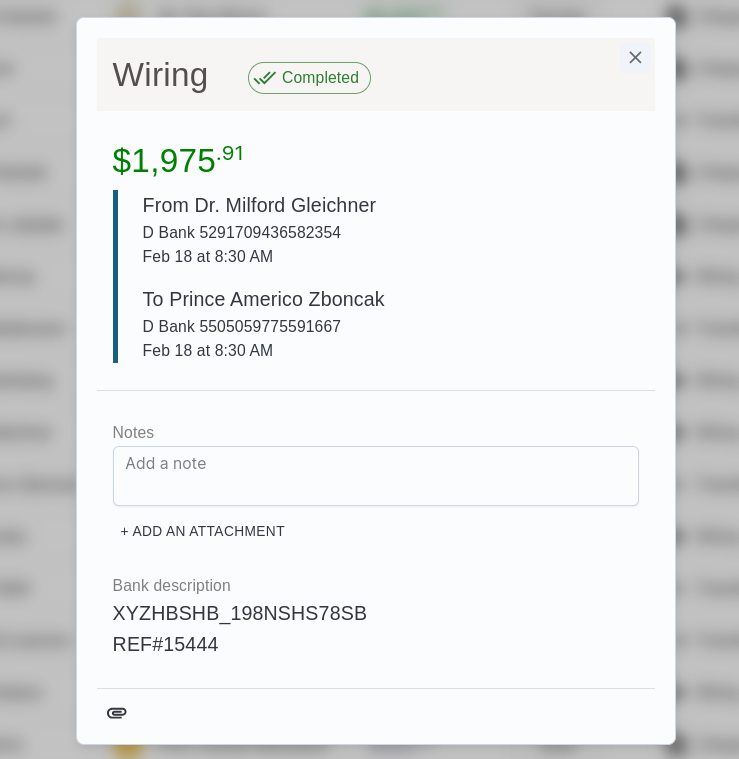

## Transactions Dashboard MVP: Machent Assignment (Go + React)

The assignment by Machnet.

- Backend Written in Go
- Postgres for DB
- Frontend With React (Typescript)

> The screenshots from dashboard are available at the end.

### Author Details:

|                                                    |                                                                      |
| -------------------------------------------------- | -------------------------------------------------------------------- |
| Name: <b>Roshan Lamichhane</b>                     | Email: <a href="lamichhanersn@gmail.com">lamichhanersn@gmail.com</a> |
| Linkedin: https://linkedin.com/in/lamichhaneroshan | Website: https://www.roshan-lamichhane.com.np                        |

### Run With Docker Compose

_NOTE: It might take a minute or two depending on your system._
```bash
# clone the reo
git clone https://github.com/roshanlc/machnet-react-golang-assignment.git

# cd into the directory
cd machnet-react-golang-assignment

# Might take some time
docker compose up

# Visit browser at http://localhost:9001
```

Visit the browser at [http://localhost:9001](http://localhost:9001)

## Backend

- Read the [Backend README.md](./backend/README.md) for backend.

Supports:

- [x] Transactions API
- [x] Pagination
- [x] Postgres DB
- [x] Dockerfile

## Frontend

- Read the [Frontend README.md](./frontend/README.md) for frontend.

Supports:

- [x] Transactions Dashboard
- [x] Single Transaction Popup/Dialog
- [x] Pagination System
- [x] 404 Error pages
- [x] Dockerfile

### Libraries

| Backend                           | Frontend     |
| --------------------------------- | ------------ |
| Gin                               | React.js     |
| GORM (ORM)                        | MUI library  |
| Faker (for dummy data generation) | React router |

### Database

- PostgreSQL

### Database Design

Further details on database is provided here at [database.md](./database.md)


### API DOCUMENTATION

| Endpoint                 | Description                                 | Supported Query Params                                  | Response | Pagination Support |
| ------------------------ | ------------------------------------------- | ------------------------------------------------------- | -------- | ------------------ |
| /api/v1/transactions     | Details of (multiple)transactions in system | **limit** (no.of items/page)<hr/>**page**(current page) | JSON     | YES                |
| /api/v1/transactions/:id | Detail of a single transaction              |                                                         | JSON     | -                  |

### API RESPONSE

```bash
curl "http://localhost:9000/api/v1/transactions?limit=1&page=1"

{
  "data": [
    {
      "ID": 1,
      "CreatedAt": "2023-10-22T08:20:06.411584+05:45",
      "UpdatedAt": "2023-10-22T08:20:06.411584+05:45",
      "DeletedAt": null,
      "Date": "2023-10-22T08:20:06.40916+05:45",
      "Amount": 1816,
      "FromAccountID": 1,
      "ToAccountID": 2,
      "TransactionStatusID": 1,
      "FromAccount": {
        "ID": 1,
        "CreatedAt": "2023-10-22T08:20:06.398986+05:45",
        "UpdatedAt": "2023-10-22T08:20:06.398986+05:45",
        "DeletedAt": null,
        "number": "5354918241276318",
        "CustomerID": 1,
        "AccountTypeID": 1,
        "Balance": 500,
        "Customer": {
          "ID": 1,
          "CreatedAt": "2023-10-22T08:20:06.389492+05:45",
          "UpdatedAt": "2023-10-22T08:20:06.389492+05:45",
          "DeletedAt": null,
          "email": "mQSuuIF@wqoporN.info",
          "name": "Miss Leola Block",
          "accounts": null,
          "bank": 1,
          "Bank": {
            "ID": 1,
            "CreatedAt": "2023-10-22T08:20:06.38397+05:45",
            "UpdatedAt": "2023-10-22T08:20:06.38397+05:45",
            "DeletedAt": null,
            "name": "A Bank",
            "description": "Banks for Awesome people",
            "Customers": null
          }
        },
        "AccountType": {
          "ID": 1,
          "CreatedAt": "2023-10-22T08:20:06.374498+05:45",
          "UpdatedAt": "2023-10-22T08:20:06.374498+05:45",
          "DeletedAt": null,
          "type": "Savings"
        }
      },
      "ToAccount": {
        "ID": 2,
        "CreatedAt": "2023-10-22T08:20:06.398986+05:45",
        "UpdatedAt": "2023-10-22T08:20:06.398986+05:45",
        "DeletedAt": null,
        "number": "5353378250700872",
        "CustomerID": 2,
        "AccountTypeID": 4,
        "Balance": 1000,
        "Customer": {
          "ID": 2,
          "CreatedAt": "2023-10-22T08:20:06.389492+05:45",
          "UpdatedAt": "2023-10-22T08:20:06.389492+05:45",
          "DeletedAt": null,
          "email": "iOBTPtv@DArcFqS.top",
          "name": "Dr. Shanelle Sporer",
          "accounts": null,
          "bank": 1,
          "Bank": {
            "ID": 1,
            "CreatedAt": "2023-10-22T08:20:06.38397+05:45",
            "UpdatedAt": "2023-10-22T08:20:06.38397+05:45",
            "DeletedAt": null,
            "name": "A Bank",
            "description": "Banks for Awesome people",
            "Customers": null
          }
        },
        "AccountType": {
          "ID": 4,
          "CreatedAt": "2023-10-22T08:20:06.374498+05:45",
          "UpdatedAt": "2023-10-22T08:20:06.374498+05:45",
          "DeletedAt": null,
          "type": "Debit"
        }
      },
      "TransactionStatus": {
        "ID": 1,
        "CreatedAt": "2023-10-22T08:20:06.405907+05:45",
        "UpdatedAt": "2023-10-22T08:20:06.405907+05:45",
        "DeletedAt": null,
        "status": "Completed"
      }
    }
  ],
  "pages": {
    "current_page": 1,
    "next_page": 2,
    "total_pages": 60,
    "limit": 1
  }
}
```

_Similarly,_

````bash
curl "http://localhost:9000/api/v1/transactions/1

{
    "data": ....
}
```
````

### Screenshots





P.S.: Experience it yourself by running the project.