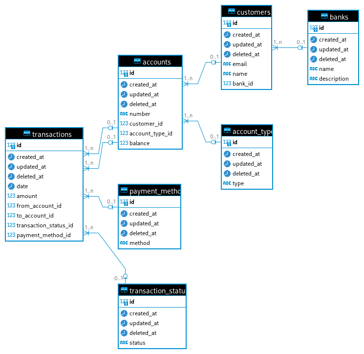

# Database Design

The database schema is as follows:  

### Tables

The explanation about tables are:

1. Payment Methods
- It holds details about payment methods. Eg. Transfer, Cheque Deposit, etc
- It holds a ‘one to many’ relation with transactions table
    - i.e A payment method entity is associated with one or many transaction entities.

2. Transaction Statuses
- It holds information related to a transaction’s status. E.g Completed, Pending.
- It also holds a ‘one to many’ relation with the transactions table.

3. Banks
- It holds information related to bank details. 
- It holds a ‘one to many’ relation with the customer table.
    - i.e A bank entity may hold one or more customers.

4. Accounts
- Table Entity to store details of customer’s accounts
- It holds a ‘zero or one’ relation with the Bank table.
- It holds a ‘one to many’ relation with the transactions table.
- It also holds a ‘zero or one’ relation with the account type table.

5. Customers
- Table entity to store details of customers.
- It holds a ‘zero or one’ relation with the Banks table.
- It holds a ‘one-to-many’ relation with the accounts table.

6. Account Type
- Table entity to store details about types of accounts. Eg. Savings, Current, …
- It holds a ‘one to many’ relation with the Accounts table.

7. Transactions
- Table Entity to store details about all the transactions that have occurred.
- It holds ‘zero or one’ relation with Accounts, transaction status and payment method table. 

